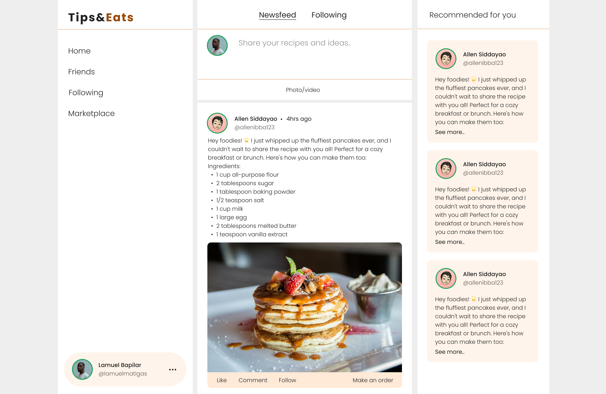
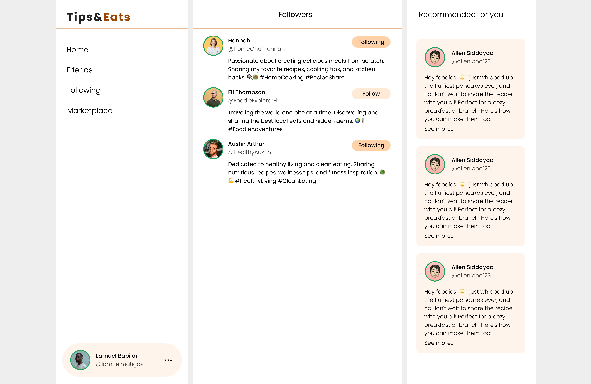
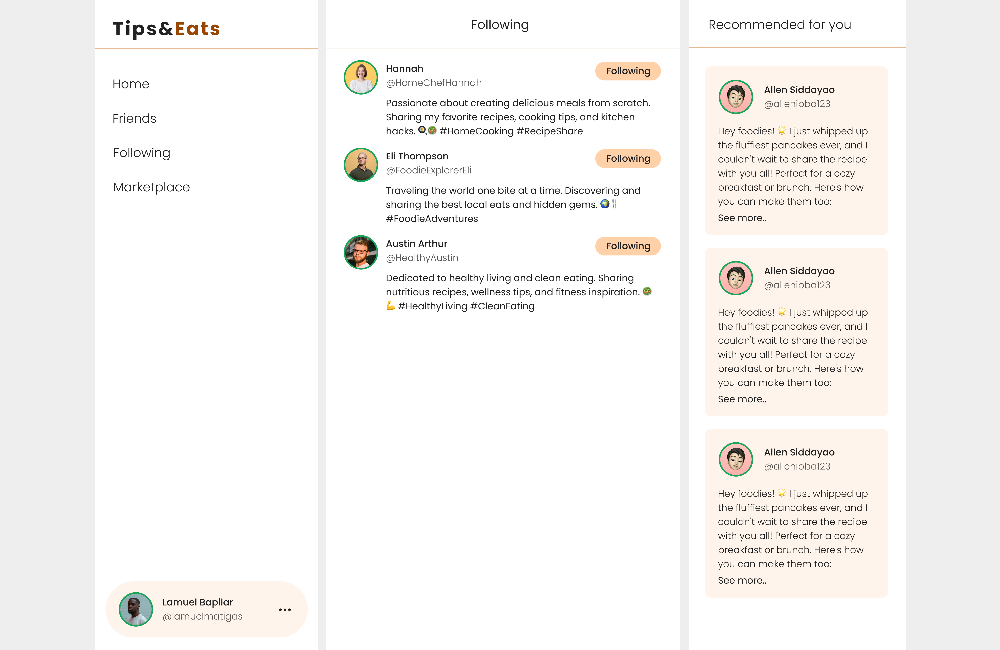
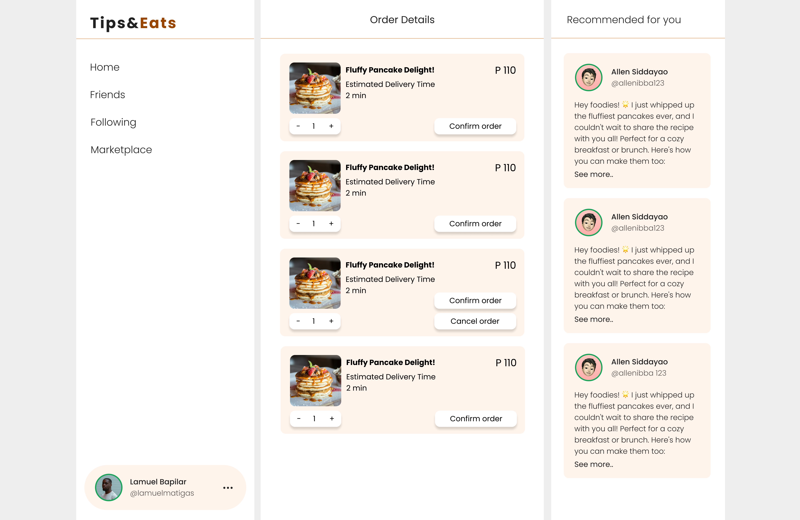

 # 🚀 Tips-Eats Setup Guide (XAMPP + PHP)
 
---

📌 Description

Tips-Eats is a web-based application built using PHP and MySQL that runs locally using XAMPP.
It includes features such as user accounts, posts, social interactions, products, orders, and reviews.

This setup guide will help you install and run the project on your local machine.

For Site Preview: https://drive.google.com/drive/folders/1urXv39s7LgAIx2C4Z-0JFnxCmjamAf8G?usp=sharing

---

## 📸 Site Preview







---
📌 Requirements

- XAMPP (Apache + MySQL)

- Web browser (Chrome, Edge, etc.)

- Git (optional)

---

### 📥 1. Download / Clone the Project

Option 1: Download ZIP

1. Click Code → Download ZIP in GitHub

2. Extract the folder

3. Click Code → Download ZIP in GitHub

4. Extract the folder

Option 2: Clone using Git

1. git clone https://github.com/your-username/tips-eats.git


### 📂 2. Move Project to XAMPP Folder

1. Go to your XAMPP folder:
```bash
C:\xampp\htdocs\
```

2. Copy your project folder inside htdocs

Example: C:\xampp\htdocs\tips-eats


### ▶️ 3. Start XAMPP Services

1. Open XAMPP Control Panel

Start:

Apache

MySQL

### 🗄️ 4. Setup Database

1. Open your browser and go to:

```bash
http://localhost/phpmyadmin
```

2. Click New and create a database (example name: tipseats_db)

3. Click the SQL tab and copy-paste the SQL query below:
(This will create all tables for the project)

```bash
CREATE TABLE users (
    user_id INT AUTO_INCREMENT PRIMARY KEY,
    first_name VARCHAR(50) NOT NULL,
    middle_name VARCHAR(50) NOT NULL,
    last_name VARCHAR(50) NOT NULL,
    suffix VARCHAR(10),
    profile_pic VARCHAR(255),
    username VARCHAR(50) NOT NULL UNIQUE,
    gender ENUM('male', 'female', 'other') NOT NULL,
    birthday DATE NOT NULL,
    phone VARCHAR(15) NOT NULL,
    email VARCHAR(100) NOT NULL UNIQUE,
    password VARCHAR(255) NOT NULL,
    street VARCHAR(100) NOT NULL,
    region VARCHAR(100) NOT NULL,
    province VARCHAR(100) NOT NULL,
    city VARCHAR(100) NOT NULL,
    barangay VARCHAR(100),
    postal_code VARCHAR(10) NOT NULL,
    is_admin BOOLEAN NOT NULL DEFAULT FALSE,
    log_date TIMESTAMP DEFAULT CURRENT_TIMESTAMP,
    status ENUM('online', 'offline') NOT NULL DEFAULT 'offline'
);

CREATE TABLE Posts (
    post_id INT AUTO_INCREMENT PRIMARY KEY,
    user_id INT,
    post_pic VARCHAR(255),
    post_content VARCHAR(255),
    profile_pic VARCHAR(255),
    first_name VARCHAR(50),
    last_name VARCHAR(50),
    username VARCHAR(50),
    date TIMESTAMP DEFAULT CURRENT_TIMESTAMP,
    status ENUM('active', 'dismissed', 'reported') DEFAULT 'active'
);

CREATE TABLE Likes ( 
    like_id INT AUTO_INCREMENT PRIMARY KEY,
    post_id INT NOT NULL,
    user_id INT NOT NULL,
    liked_at TIMESTAMP DEFAULT CURRENT_TIMESTAMP,
    FOREIGN KEY (post_id) REFERENCES Posts(post_id) ON DELETE CASCADE,
    FOREIGN KEY (user_id) REFERENCES Users(user_id) ON DELETE CASCADE
);

CREATE TABLE Comments (
    comment_id INT AUTO_INCREMENT PRIMARY KEY,
    post_id INT NOT NULL,
    user_id INT NOT NULL,
    comment_content TEXT NOT NULL,
    profile_pic VARCHAR(255),
    first_name VARCHAR(100) NOT NULL,
    last_name VARCHAR(100) NOT NULL,
    username VARCHAR(100) NOT NULL,
    created_at DATETIME DEFAULT CURRENT_TIMESTAMP,
    FOREIGN KEY (post_id) REFERENCES Posts(post_id) ON DELETE CASCADE,
    FOREIGN KEY (user_id) REFERENCES Users(user_id) ON DELETE CASCADE
);

CREATE TABLE Follows (
    follow_id INT AUTO_INCREMENT PRIMARY KEY,
    user_id INT NOT NULL,
    follower_id INT NOT NULL,
    followed_at TIMESTAMP DEFAULT CURRENT_TIMESTAMP,
    FOREIGN KEY (user_id) REFERENCES Users(user_id) ON DELETE CASCADE,
    FOREIGN KEY (follower_id) REFERENCES Users(user_id) ON DELETE CASCADE
);

CREATE TABLE CommentLikes (
    like_id INT AUTO_INCREMENT PRIMARY KEY,
    comment_id INT NOT NULL,
    user_id INT NOT NULL,
    liked_at TIMESTAMP DEFAULT CURRENT_TIMESTAMP,
    FOREIGN KEY (comment_id) REFERENCES Comments(comment_id) ON DELETE CASCADE,
    FOREIGN KEY (user_id) REFERENCES Users(user_id) ON DELETE CASCADE
);

CREATE TABLE Products (
    product_id INT AUTO_INCREMENT PRIMARY KEY,
    user_id INT NOT NULL,
    product_title VARCHAR(255) NOT NULL,
    product_content TEXT NOT NULL,
    product_pic VARCHAR(255),
    price DECIMAL(10, 2) NOT NULL,
    date TIMESTAMP DEFAULT CURRENT_TIMESTAMP,
    status ENUM('active', 'dismissed', 'reported') DEFAULT 'active',
    FOREIGN KEY (user_id) REFERENCES Users(user_id) ON DELETE CASCADE
);

CREATE TABLE Orders (
    order_id INT AUTO_INCREMENT PRIMARY KEY,
    product_id INT NOT NULL,
    seller_id INT NOT NULL,
    buyer_id INT NOT NULL,
    order_title VARCHAR(255) NOT NULL,
    order_price DECIMAL(10, 2) NOT NULL,
    order_quantity INT DEFAULT 1,
    order_finalprice DECIMAL(10, 2) NOT NULL,
    order_status ENUM('preparing', 'delivering', 'delivered', 'pending') DEFAULT 'pending',
    buyer_city VARCHAR(255) NOT NULL,
    buyer_number VARCHAR(20) NOT NULL,
    buyer_status ENUM('confirmed', 'cancelled', 'pending') DEFAULT 'pending',
    seller_city VARCHAR(255) NOT NULL,
    seller_status ENUM('approved', 'rejected', 'pending') DEFAULT 'pending',
    ordered_at TIMESTAMP DEFAULT CURRENT_TIMESTAMP,
    FOREIGN KEY (product_id) REFERENCES Products(product_id) ON DELETE CASCADE,
    FOREIGN KEY (seller_id) REFERENCES Users(user_id) ON DELETE CASCADE,
    FOREIGN KEY (buyer_id) REFERENCES Users(user_id) ON DELETE CASCADE
);

CREATE TABLE PostReports (
    report_id INT AUTO_INCREMENT PRIMARY KEY,
    post_id INT NOT NULL,
    reported_id INT NOT NULL,
    reporter_username VARCHAR(50),
    reported_username VARCHAR(50),
    report_type VARCHAR(50),
    report_issue VARCHAR(255),
    report_description VARCHAR(255),
    status_report ENUM('resolved', 'unresolved') NOT NULL DEFAULT 'unresolved',
    date TIMESTAMP DEFAULT CURRENT_TIMESTAMP,
    FOREIGN KEY (reported_id) REFERENCES Users(user_id) ON DELETE CASCADE
);

CREATE TABLE Reviews (
    review_id INT AUTO_INCREMENT PRIMARY KEY,
    product_id INT NOT NULL,
    user_id INT NOT NULL,
    rating INT NOT NULL CHECK (rating BETWEEN 1 AND 5),
    review_content TEXT NOT NULL,
    profile_pic VARCHAR(255),
    first_name VARCHAR(100) NOT NULL,
    last_name VARCHAR(100) NOT NULL,
    username VARCHAR(100) NOT NULL,
    created_at DATETIME DEFAULT CURRENT_TIMESTAMP,
    FOREIGN KEY (product_id) REFERENCES Products(product_id) ON DELETE CASCADE,
    FOREIGN KEY (user_id) REFERENCES Users(user_id) ON DELETE CASCADE
);
```

5. On your Project Folder, Open backend/connection.php and change the designated variables to match your local setup:

```bash
$servername = "localhost";
$username = "root";
$password = "";
$dbname = "tipseats_db";  // Make sure this matches the database you just created
```
